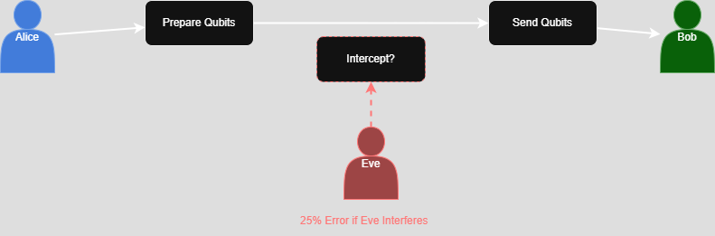
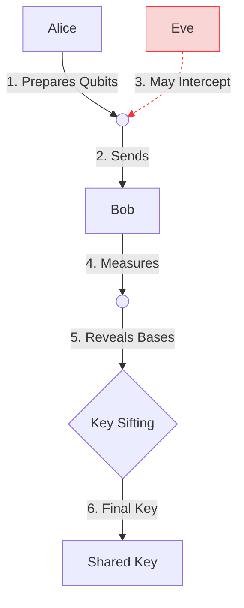

# 🔐 Quantum Key Distribution (BB84) Simulator

[](LICENSE)
[](https://www.python.org/downloads/)

Simulates quantum-secured key exchange with eavesdropping detection using Qiskit.


*(Diagram: BB84 key exchange process)*



## Features
- 🎯 **BB84 Protocol** implementation
- 🔍 **25% error rate** eavesdropping detection
- 📊 **Bloch sphere visualization** of qubit states
- ⚡ **Interactive key verification**

## Usage
```bash
# Clone repository
git clone https://github.com/yourusername/QKD-BB84-Simulator.git
cd QKD-BB84-Simulator

# Install dependencies
pip install -r requirements.txt

# Run simulation
python qkd_simulation.py
