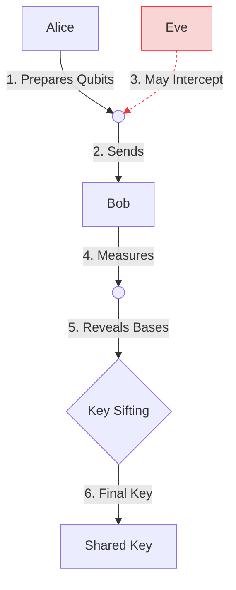

![BB84 Protocol]


## Why Quantum Cryptography?
- Traditional encryption (RSA) will be broken by quantum computers
- BB84 protocol uses quantum mechanics for **provable security**

## How My Simulator Works
```python
# Key generation snippet
def encode_qubit(bit, basis):
    qc = QuantumCircuit(1)
    if basis == '×': qc.h(0)
    if bit == 1: qc.x(0)
    return qc
```
---
Key Features
✅ Eavesdropping detection (25% error rate)

📊 Bloch sphere visualization (see below)


---
Try It Yourself

git clone https://github.com/yourusername/QKD-BB84-Simulator.git
pip install -r requirements.txt
python qkd_simulation.py
---
